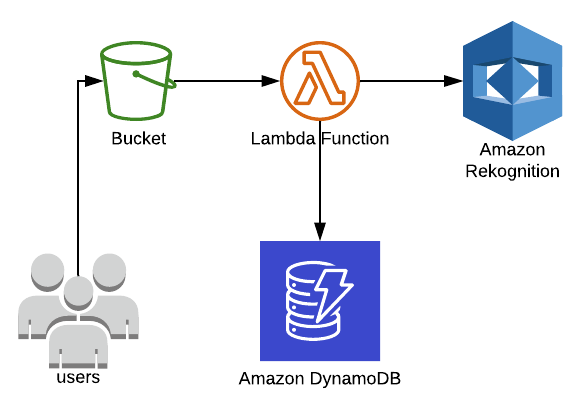

# Rekognition Demo

Demo project for AWS Rekognition.

Here's how it works:

1. User uploads image to S3 bucket (use [/images](/images)).
2. S3 bucket emits an event to Lambda with the image info.
3. Lambda uses AWS Rekognition to detect text from image.
4. Lambda stores structured text in DynamoDB.

The following diagram illustrates the solution:

## How to run

Provsion the environment using the [CloudFormation](environment.yml) template available. Upload the images available inside the [/images](/images) folder to the newly created bucket. Wait a few seconds and check DynamoDB for new items.
